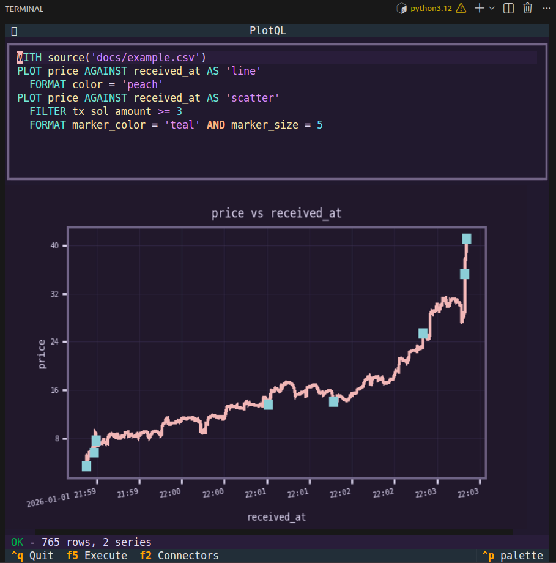

# PlotQL

A SQL-like query language for creating plots. No Python boilerplate, no remembering matplotlib syntax — just describe what you want to plot.



## Quick Start

The easiest way to use PlotQL is through the interactive TUI:

```bash
# Setup (requires uv)
git clone https://github.com/your-username/plotql.git
cd plotql && ./ctl.sh setup
source .venv/bin/activate

# Launch the TUI
plotql
```

Write queries like:

```sql
WITH source('docs/example.csv')
    PLOT price AGAINST received_at AS 'line'
    FORMAT color = 'peach'
```

Press `F5` to execute. See [TUI documentation](docs/ui.md) for keyboard shortcuts and features.

If you don't have `uv`, install it from [astral.sh/uv](https://docs.astral.sh/uv/getting-started/installation/).

## Python API

PlotQL's core is a standalone library, independent of the TUI. Use it in scripts, Jupyter notebooks, or embed it in your own applications:

```python
from plotql.core import parse, execute, render

query = parse("WITH 'data.csv' PLOT revenue AGAINST month AS 'bar'")
data = execute(query)
result = render(data)

result.save("chart.png")     # Save to file
result.show()                # Display in Jupyter
result.figure                # Access matplotlib figure for customization
```

This separation means you can use PlotQL's query language in whatever context makes sense for your workflow.

## Documentation

- **[Syntax & Python API](docs/syntax.md)** — Full language reference, operators, aggregations, and Python usage
- **[Connectors](docs/connectors.md)** — Data sources: files, folders, ClickHouse databases
- **[Engines](docs/engines.md)** — Rendering backends and customization
- **[TUI](docs/ui.md)** — Interactive terminal interface

## Contributing

See **[CONTRIBUTING.md](CONTRIBUTING.md)** for:

- Development setup
- Architecture overview (core/engines/connectors/UI separation)
- Theme system
- Tree-sitter grammar workflow
- Feature checklist

## License

MIT
