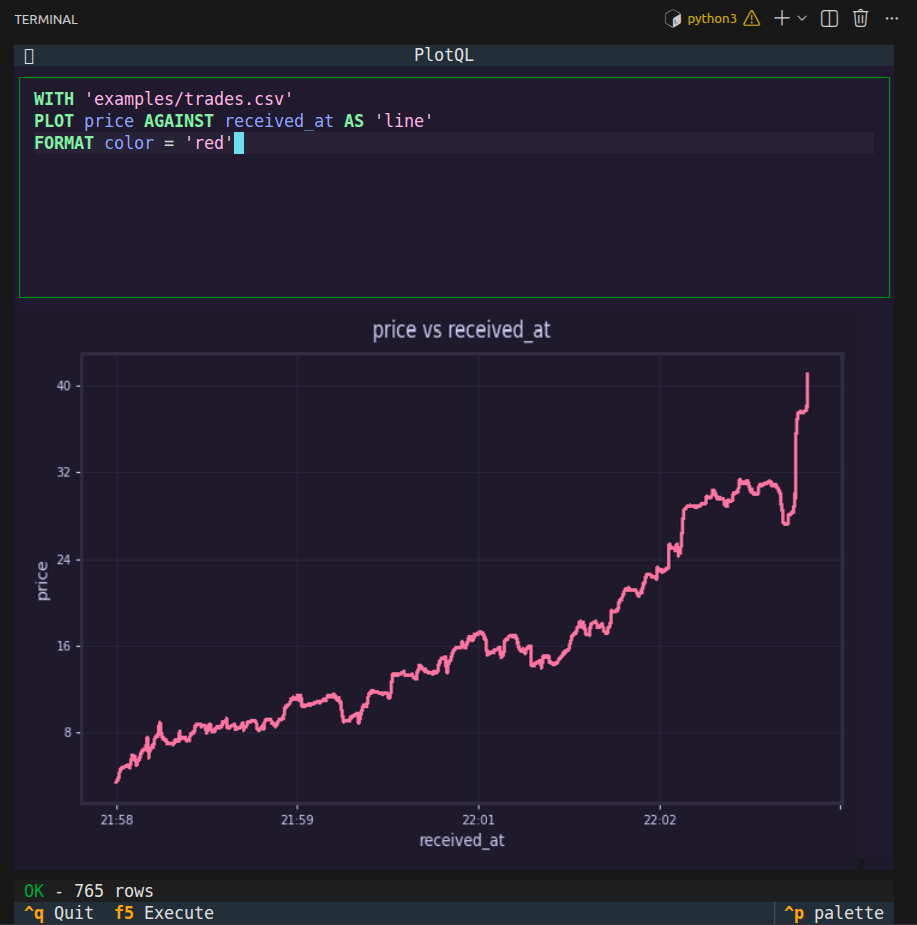

# PlotQL

A SQL-like query language for plotting data. No Python boilerplate, no remembering matplotlib syntax - just describe what you want to plot.



## The Language

PlotQL is a query language for plotting. The core syntax is:

```
WITH '<data_source>' PLOT <y_column> AGAINST <x_column> [AS <plot_type>]
```

The repository also ships with a Textual UI which uses the core plotQL API.

### Basic Examples

```sql
-- Simple line plot
WITH 'sales.csv' PLOT revenue AGAINST date

-- Scatter plot with explicit type
WITH 'data.csv' PLOT price AGAINST quantity AS scatter

-- Bar chart
WITH 'stats.csv' PLOT count AGAINST category AS bar
```

### Filtering Data

```sql
-- Filter with conditions
WITH 'trades.csv' PLOT price AGAINST time
FILTER side = 'buy' AND quantity > 100

-- Multiple conditions
WITH 'sensors.csv' PLOT temperature AGAINST timestamp
FILTER location = 'warehouse' AND temperature > 20
```

### Aggregations

```sql
-- Group and aggregate
WITH 'orders.csv' PLOT sum(amount) AGAINST customer AS bar

-- Available functions: sum, avg, count, min, max, median
WITH 'logs.csv' PLOT count(event) AGAINST hour AS bar
```

### Multiple Series

Layer multiple plots on the same chart. Later series render on top:

```sql
-- Highlight specific points by overlaying a filtered series
WITH 'trades.csv'
PLOT price AGAINST time
PLOT price AGAINST time
    FILTER user_id = 'vip'
    FORMAT marker_size = 5

-- Compare different metrics
WITH 'stocks.csv'
PLOT open AGAINST date AS line
PLOT close AGAINST date AS line
    FORMAT line_color = 'red'
```

Each `PLOT` clause can have its own `FILTER` and `FORMAT` options.

### Styling

```sql
-- Custom colors and labels
WITH 'data.csv' PLOT value AGAINST time
FORMAT title = 'My Chart' AND xlabel = 'Time' AND ylabel = 'Value'

-- Dynamic marker sizing by column
WITH 'data.csv' PLOT price AGAINST time AS scatter
FORMAT marker_size = volume AND marker_color = category
```

### Plot Types

- `line` (default) - Line chart
- `scatter` - Scatter plot
- `bar` - Bar chart
- `hist` - Histogram

## Usage

### Command Line

```bash
# Interactive TUI
plotql

# Execute a query directly
plotql -c "WITH 'data.csv' PLOT price AGAINST time"

# Run a .pql file
plotql query.pql

# Save output to file
plotql -c "..." -o chart.png
```

### Python API

```python
from plotql import parse, execute
from plotql.core.engines import get_engine

# Parse and execute a query
query = parse("WITH 'data.csv' PLOT price AGAINST time")
result = execute(query)

# Render to an image
engine = get_engine('matplotlib')
image = engine.render(query, result.data)
image.save('output.png')
```

### Jupyter Notebooks

```python
from plotql import plot

# One-liner plotting
plot("WITH 'data.csv' PLOT price AGAINST time")

# Or step by step
from plotql import parse, execute
from plotql.core.engines import get_engine

query = parse("WITH 'data.csv' PLOT revenue AGAINST month AS bar")
result = execute(query)

engine = get_engine('matplotlib')
engine.render(query, result.data)  # Displays inline in Jupyter
```

## Interactive TUI

PlotQL includes a terminal UI built with Textual for interactive querying:

- Syntax highlighting
- Autocomplete for keywords and column names
- Live plot preview
- Error display

Launch with:

```bash
plotql
```

**Keyboard shortcuts:**
- `Ctrl+Enter` - Execute query
- `Ctrl+S` - Save plot to file
- `Ctrl+Q` - Quit

## Setup

### Requirements

- Python 3.10+
- Node.js (for building the tree-sitter grammar)

### Installation

```bash
# Clone the repository
git clone https://github.com/your-username/plotql.git
cd plotql

# Run setup (requires uv)
./ctl.sh setup

# Activate the environment
source .venv/bin/activate

# Run PlotQL
plotql
```

If you don't have `uv`, install it from [astral.sh/uv](https://docs.astral.sh/uv/getting-started/installation/).

## Building

The project uses a tree-sitter grammar for parsing and syntax highlighting.

```bash
# Rebuild the grammar after changes to grammar.json
./ctl.sh compile
```

## Contributing

Contributions are welcome! Here's how to get started:

1. Fork the repository
2. Create a feature branch: `git checkout -b feature/my-feature`
3. Make your changes
4. Run tests: `./ctl.sh test`
5. Submit a pull request

### Development Setup

```bash
./ctl.sh setup
```

## License

MIT
